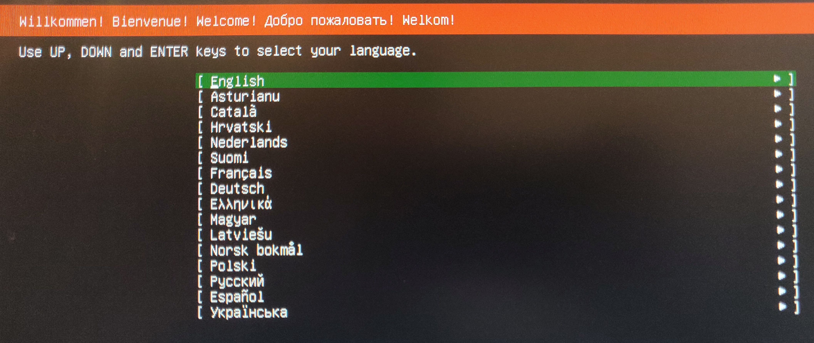
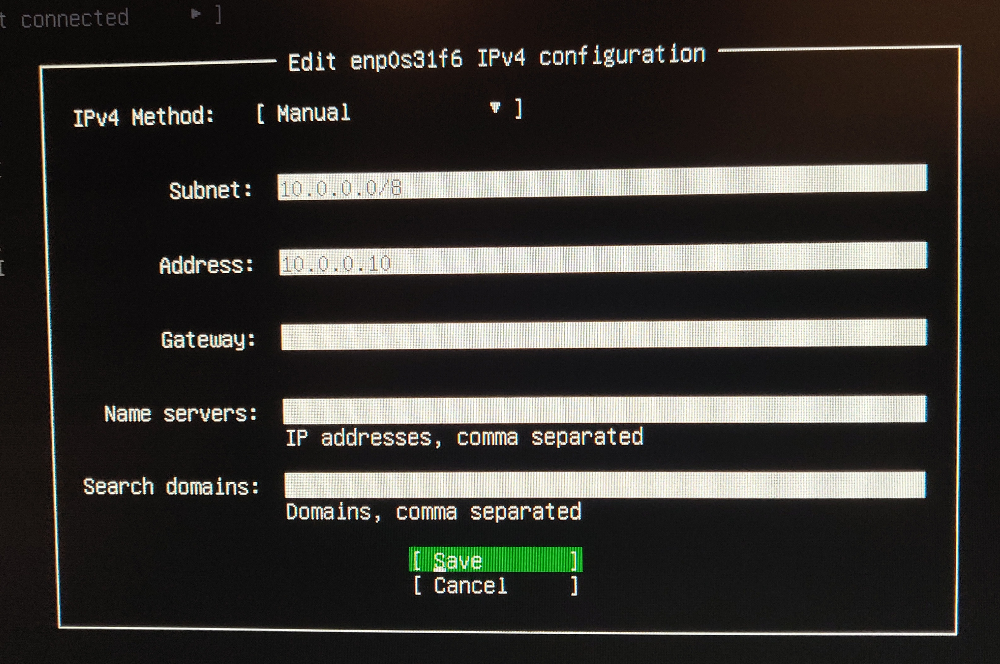
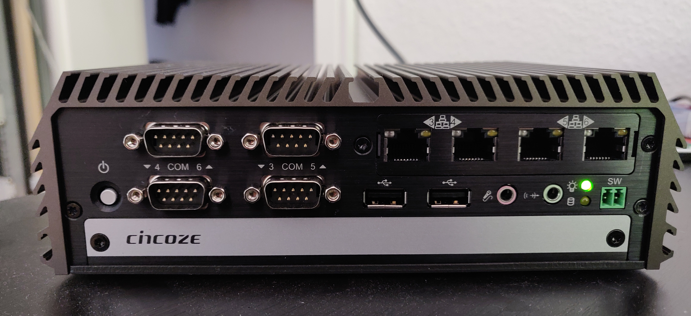
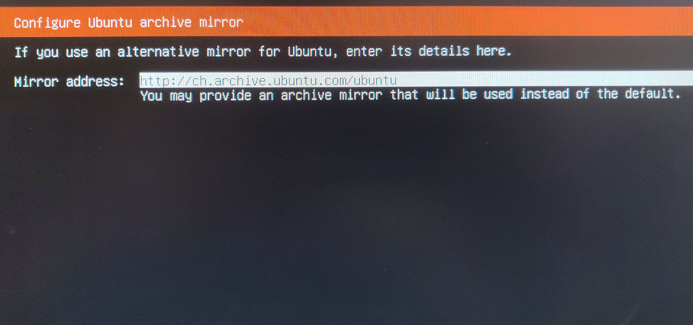
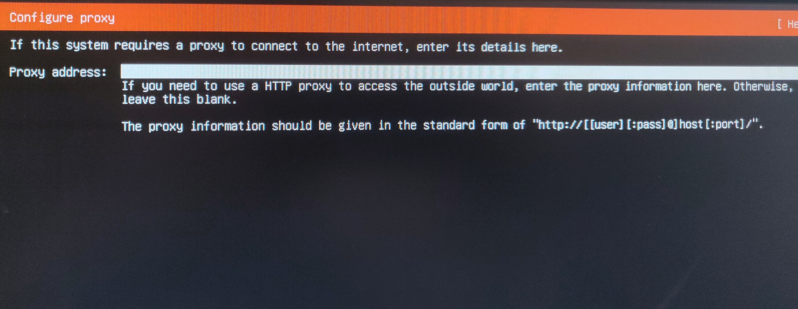
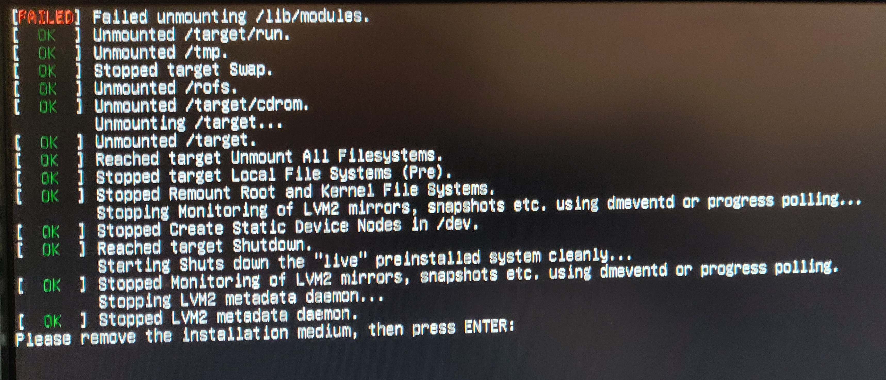
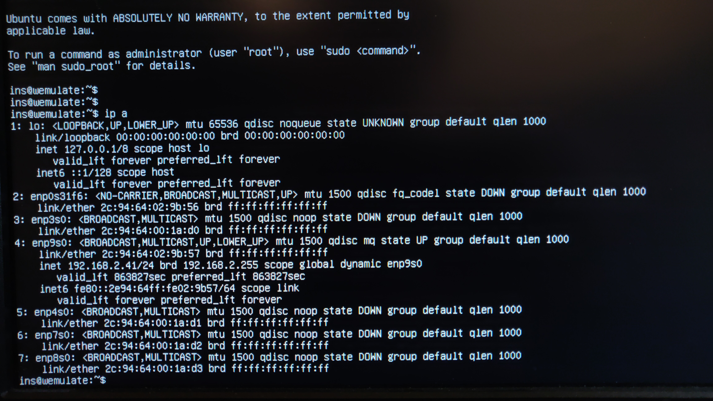

# DI-1000 - Fanless Embedded PC

## Facts
All the facts are from [compmall](https://www.comp-mall.de/Industrie-PC-Produkte/Embedded-PC/Din-Rail-PCs/DI-1000)

* [Product Page](https://www.comp-mall.de/Industrie-PC-Produkte/Embedded-PC/Din-Rail-PCs/DI-1000)
* Intel Core i5
* 6 Ethernet Ports

## Installation
This section describes step-by-step how to install Ubuntu 20.04 on the hardware.

1. Select the language
    

2. Select the keyboard language
    

3. The device has 6 interfaces in total. 2 on the back side. These interfaces will be used as management interfaces. One interface will get a dynamic IP addres via DHCP and the other interface will get a static IP address of `10.0.0.10/24`.
    Configure the static interface like on the picture below.
    Gateway, name servers and search domain are not required. 
    Label the interface which will have static ip address on the back of the device. 

    

    The other 4 interfaces are located on the front of the device. 
    Do not configure these interfaces and leave them in the status `disabled`.
    Note wich interface is which one and label the interfaces on the front of the device with `LAN-A` - `LAN-D`.

    
    
    After all interfaces are configured, the interface overview should look like below.

    

4. Leave the ubuntu mirror to the default value. 

    

5. Configure no proxy.

    

6. Do not change any configuration on the storage, leave it as it is.

    

7. Configure `your name`, `server name`, `username` and `password`.

    

8. In the SSH setup make sure `install OpenSSH server` is checked.

    

9. Do not check any features on this page. Everything needed will be installed via the install script.

    

10. Start the installation and wait until it is finished. 

    

11. Restart device when it says so and unmount the installation medium after rebooting.

    

12. Wait until cloudinit has finished.

    

13. Login and check that all interfaces are visible with the `ip a` command. The static configured interface will be down if the cable is not plugged in. Confirm the IP address of that interface is configured in the cloudinit file `/etc/cloud/cloud.cfg.d/50-curting-networking.cfg`.

    

14. Create a netplan configuration file that contains all other interfaces than the interfaces that were configured in the previous steps. In this case those are the interfaces `enp3s0`, `enp4s0`, `enp7s0` and `enp8s0` are the ones on the back of the device and need to be written to the file `/etc/netplan/51-wemulate-connection-interfaces.yaml`.
    
    After adding the file run `netplan apply` to make the changes effective.
    This will make it possible that the interfaces will come in an `UP` state as soon as the cables will be plugged in.

```yaml
---
network:
version: 2
renderer: networkd
ethernets:
enp3s0:
    dhcp4: false
enp4s0:
    dhcp4: false
enp7s0:
    dhcp4: false
enp8s0:
    dhcp4: false
```
